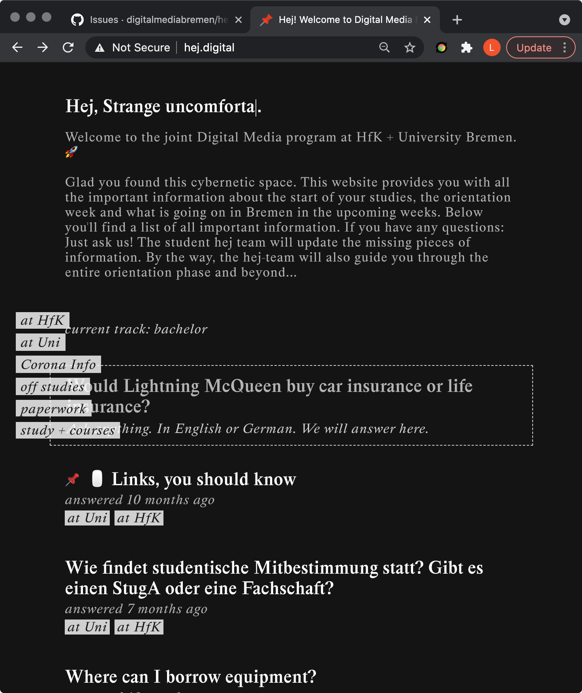
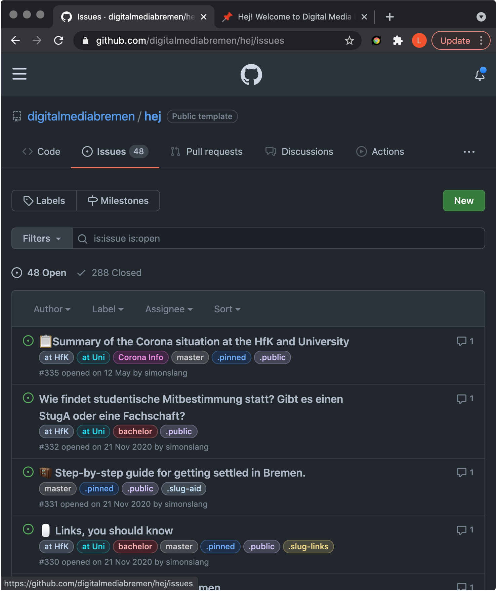
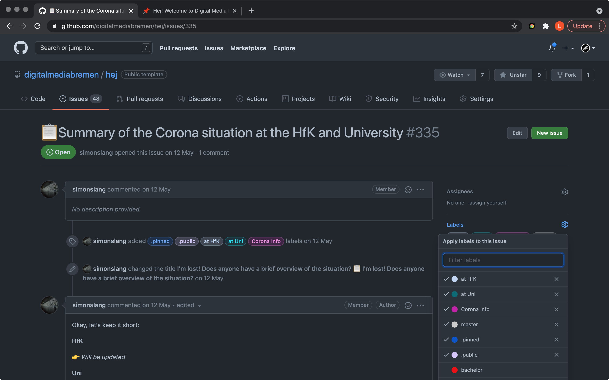

# Hej

Hej is an interactive and moderated Q&A tool.

Hej can be also understood as an alternative way to display github issues in a visually reduced way.

## How to operate hej

To learn to operate hej means to understand how gitub issues work and what means what.

| Hej      | Github           |
| -------- | ---------------- |
| `Question` | `Issue`            |
| `Answer`   | `Comment` on `Issue` |
| `Filter`   | `Label`            |

If a user ask a question in hej an issue is created in github automatically. The issue can and should be then edited in github by you to fit the question to a wider audience or to make it more easily understandable.
Have a look at how _questions_ are represented as _issues_ in github:

| Hej                    | Gitub                    |
| ---------------------- | ------------------------- |
|  |  |

The issue page can be found here: https://github.com/{{path-to-your-repo}}/issues

### Answering questions

To answer questions simply write one or multiple comments on the issue page in github. These will be shown as individual answers in hej on the questions page, with a date when the answer was last edited.

You can also include embedded videos, images and lists in your answers.
Todo: Answers are written in markdown. Have a look at that.

🚀 Great, you got the basics of operating hej. Now lets move on to understand _filters_ or _labels_, how they are called in the github world.

ToDo: assign people

### Labels, Filters, etc...

We learned that _filters_ means _label_ in the github world. There are multiple things which can be done with labels in hej.

First have a look at your labels in github at: https://github.com/{{path-to-your-repo}}/labels.
Github creates lables by default, remove those or edit them to your needs.

To every issue in github, we can add multiple labels, we can create labels on the fly, remove them, and we even see a history of when a labels was added or removed:



Now that you know how you to create, edit and assign labels to issues, let's look at what you can do with labels in hej.

1. **Tracks**
    When you first open hej you choose a track. Tracks can be thougt of as channels. For example one is interested in info regarding a bachelors degree, the other is enrolled in masters and only wants to see info regarding his degree. 
    You can change the track in hej at any time.

2. **Filters**
    Filters can be understood as topics. They are displayed in the left sidebar in hej and help to group your questions. Questions can have multiple filters.
    Filters should not be treated as a static one-time thing: With new questions arise new topics, add new filters if you need them and remove unused ones from time to time.

3. **Hidden labels (starting with a dot)**
    Hidden labels start with a dot eg `.public` and are neither Filters nor Tracks.
    Hidden labels serve special purposes in hej. The most important one beeing `.public`.

    3.1 **`.public`**
    As we know, every issue in github is a question in hej. That is not completly true, correct would be: Every issue in github which has the label `.public` assigned is displayed as an question in hej. You get the idea, with `.public` we can control what is visible to the user and what is not.

    3.2 **`.pinned`**
    You already know what `.pinned` does, right? `.pinned` puts  your question to the top. You can pin multiple questions, alltough it is not recommended. 

    3.3 **`.slug-[something]`**
    A slug is a "[...] part of a URL which identifies a particular page on a website in a form readable by users."
    Certain questions or pieces of info might be visited by users multiple times a day.
    Imagine you provide a schedule for an orientation week with places, dates, and useful information, or a ticker with live information. In these cased it makes sense to use slugs to create direct links in your application.
    A question with slug `.slug-schedule` would be accessible with, https://{{your-hej-domain}}/schedule.
    **Beware: One slug should be used for one question only.**

Currently there is now easy way to change which labels are tracks. Please contact leo in case you want to change your tracks.


## How to collaborate on Hej

Todo: rework this section

If you want to fix a bug or add functionality to hej, these are the steps to follow.

### install locally (Mac OSX)

You need to have npm installed. if not do `brew install npm`. If you dont have brew installed [have a look here](https://docs.brew.sh/Installation.html)

then do:
```
git clone https://github.com/digitalmediabremen/hej.git
npm install
npm start
```

This should install and start a local development server accessible at [localhost:3000](http://localhost:3000)

### deploy to live server

Every successfull build of the remote master branch will be deployed to hej.digital automatically. 
If you work on a bigger feature use a seperate branch or avoid pushing to the remote master branch until you are done.